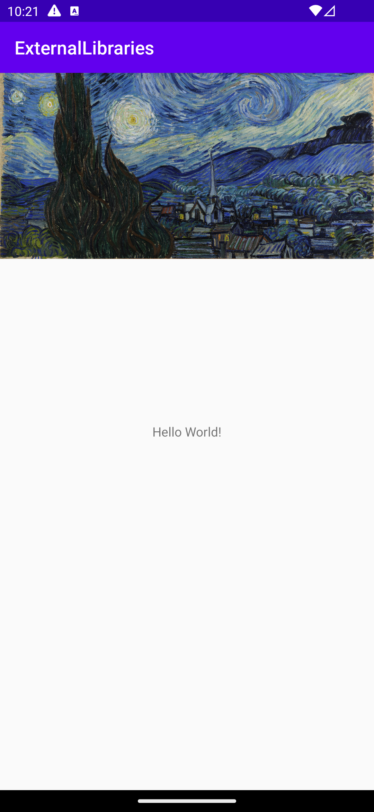

# Rapport

Appen skapades genom att använda biblioteket Glide.

Biblioteket används genom att skriva in detta i `build.gradle`.
```
repositories {
  google()
  mavenCentral()
}

dependencies {
  implementation 'com.github.bumptech.glide:glide:4.15.1'
}
```

Bilden visas genom koden `Glide.with(this).load(imageUrl).into(imageView)`. `Glide.with(this)` specifierar vart man ska använda glide. `.load(imageUrl)` specifierar vart ifrån bilden hämtas. `.into(imageView)` berättar vart bilden ska laddas till.
```
imageView = findViewById(R.id.my_image_view);

String imageUrl = "https://url.com/image.jpeg/";

Glide.with(this)
    .load(imageUrl)
    .into(imageView);
```

Slutprodukt:
